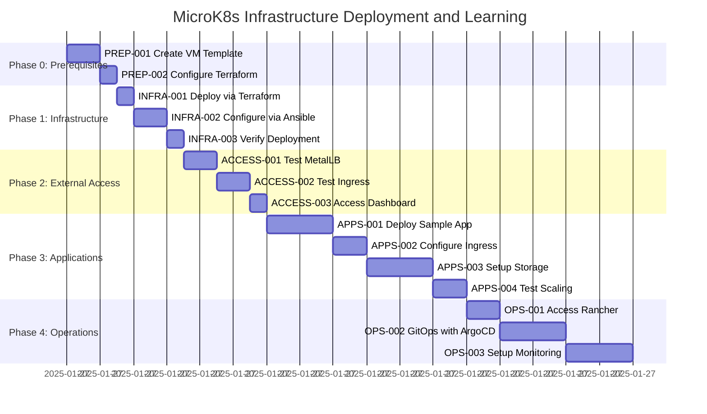

# Task Tracker - MicroK8s Homelab Learning Journey

## Executive Summary

This tracker manages the deployment and learning journey for a MicroK8s homelab cluster using Infrastructure as Code. The repository contains Terraform for VM provisioning and Ansible for cluster configuration. The infrastructure consists of 4 VMs: 3 MicroK8s nodes + 1 jumpbox, with automated deployment of MicroK8s, Rancher, and ArgoCD.

## Task Categories

Aligned with the Infrastructure as Code approach and learning roadmap:

- **PREP** (prep/): Prerequisites - Proxmox VM template creation, Terraform configuration
- **INFRA** (infra/): Infrastructure deployment - Terraform provisioning, Ansible automation
- **ACCESS** (access/): External connectivity - Testing MetalLB, cert-manager, ingress (already automated)
- **APPS** (apps/): Application deployment - Sample apps, persistent storage, scaling
- **OPS** (ops/): Operations - Using Rancher and ArgoCD (already deployed by Ansible)

## Current Status Overview

### Phase Progress

| Phase                  | Completion | Status         |
| ---------------------- | ---------- | -------------- |
| Prerequisites          | 50%        | 🚧 In Progress |
| Infrastructure Deploy  | 0%         | ⏸️ Blocked     |
| External Access        | 0%         | ⏸️ Blocked     |
| Application Deployment | 0%         | ⏸️ Blocked     |
| Advanced Operations    | 0%         | ⏸️ Blocked     |

### Quick Metrics

- **Critical Path Duration**: ~4 hours (automated deployment)
- **Total Effort Required**: ~16 hours
- **Target Completion**: 2-3 weeks
- **Blockers**: None - PREP-002 ready to start

## Phase 0: Prerequisites

### Required Setup (P0)

| Task ID                                          | Title                                   | Priority | Duration | Dependencies | Status      |
| ------------------------------------------------ | --------------------------------------- | -------- | -------- | ------------ | ----------- |
| [PREP-001](prep/PREP-001-create-vm-template.md)  | Create Proxmox VM template from Ubuntu  | P0       | 1h       | None         | ✅ Complete |
| [PREP-002](prep/PREP-002-configure-terraform.md) | Configure terraform.tfvars from example | P0       | 30m      | PREP-001     | 🔄 Ready    |

**Phase 0 Total**: ~1.5 hours

## Phase 1: Infrastructure Deployment

### Automated Deployment (P0)

| Task ID                                           | Title                                               | Priority | Duration | Dependencies | Status     |
| ------------------------------------------------- | --------------------------------------------------- | -------- | -------- | ------------ | ---------- |
| [INFRA-001](infra/INFRA-001-terraform-deploy.md)  | Deploy 4 VMs via Terraform (3 MicroK8s + 1 jumpbox) | P0       | 30m      | PREP-002     | ⏸️ Blocked |
| [INFRA-002](infra/INFRA-002-ansible-configure.md) | Configure MicroK8s cluster via Ansible              | P0       | 1h       | INFRA-001    | ⏸️ Blocked |
| [INFRA-003](infra/INFRA-003-verify-deployment.md) | Verify cluster, Rancher, and ArgoCD deployment      | P1       | 30m      | INFRA-002    | ⏸️ Blocked |

**Phase 1 Total**: ~2 hours

## Phase 2: External Access Testing

### Learning Tasks (P1)

| Task ID                                             | Title                                          | Priority | Duration | Dependencies | Status     |
| --------------------------------------------------- | ---------------------------------------------- | -------- | -------- | ------------ | ---------- |
| [ACCESS-001](access/ACCESS-001-test-metallb.md)     | Test MetalLB load balancing (pre-configured)   | P1       | 1h       | INFRA-003    | ⏸️ Blocked |
| [ACCESS-002](access/ACCESS-002-test-ingress.md)     | Test ingress and cert-manager (pre-configured) | P1       | 1h       | ACCESS-001   | ⏸️ Blocked |
| [ACCESS-003](access/ACCESS-003-access-dashboard.md) | Access Kubernetes dashboard                    | P1       | 30m      | ACCESS-002   | ⏸️ Blocked |

**Phase 2 Total**: ~2.5 hours

## Phase 3: Application Deployment (Week 3)

### Core Learning Tasks (P0)

| Task ID                                               | Title                                 | Priority | Duration | Dependencies | Status     |
| ----------------------------------------------------- | ------------------------------------- | -------- | -------- | ------------ | ---------- |
| [APPS-001](apps/APPS-001-deploy-sample-app.md)        | Deploy sample application             | P0       | 2h       | ACCESS-004   | ⏸️ Blocked |
| [APPS-002](apps/APPS-002-configure-ingress.md)        | Configure ingress for external access | P0       | 1h       | APPS-001     | ⏸️ Blocked |
| [APPS-003](apps/APPS-003-setup-persistent-storage.md) | Set up persistent storage             | P0       | 2h       | APPS-002     | ⏸️ Blocked |

### Validation Tasks (P1)

| Task ID                                   | Title                    | Priority | Duration | Dependencies | Status     |
| ----------------------------------------- | ------------------------ | -------- | -------- | ------------ | ---------- |
| [APPS-004](apps/APPS-004-test-scaling.md) | Test application scaling | P1       | 1h       | APPS-003     | ⏸️ Blocked |

**Phase 3 Total**: ~6 hours

## Phase 4: Advanced Operations

### Using Pre-Deployed Tools (P2)

| Task ID                                      | Title                                        | Priority | Duration | Dependencies | Status     |
| -------------------------------------------- | -------------------------------------------- | -------- | -------- | ------------ | ---------- |
| [OPS-001](ops/OPS-001-access-rancher.md)     | Access and explore Rancher (pre-deployed)    | P2       | 1h       | APPS-004     | ⏸️ Blocked |
| [OPS-002](ops/OPS-002-gitops-with-argocd.md) | Configure GitOps with ArgoCD (pre-deployed)  | P2       | 2h       | OPS-001      | ⏸️ Blocked |
| [OPS-003](ops/OPS-003-setup-monitoring.md)   | Deploy monitoring stack (Prometheus/Grafana) | P2       | 2h       | OPS-002      | ⏸️ Blocked |

**Phase 4 Total**: ~5 hours

## Task Dependencies


## Execution Timeline



## Critical Path

The deployment follows this automated sequence:

1. **Phase 0: Prerequisites** (~1.5 hours):

   - PREP-001: Create Proxmox VM template from Ubuntu Server
   - PREP-002: Configure terraform.tfvars with your environment

2. **Phase 1: Automated Infrastructure** (~2 hours):

   - INFRA-001: Deploy 4 VMs via Terraform (3 MicroK8s nodes + 1 jumpbox)
   - INFRA-002: Configure complete stack via Ansible (MicroK8s, Rancher, ArgoCD)
   - INFRA-003: Verify all components are deployed

3. **Phase 2: External Access Testing** (~2.5 hours):

   - ACCESS-001: Test MetalLB load balancing (already configured)
   - ACCESS-002: Test ingress and cert-manager (already configured)
   - ACCESS-003: Access Kubernetes dashboard

4. **Phase 3: Application Deployment** (~6 hours):

   - APPS-001: Deploy sample application
   - APPS-002: Configure ingress for external access
   - APPS-003: Set up persistent storage
   - APPS-004: Test application scaling

5. **Phase 4: Advanced Operations** (~5 hours):
   - OPS-001: Access and explore Rancher (pre-deployed)
   - OPS-002: Configure GitOps with ArgoCD (pre-deployed)
   - OPS-003: Deploy monitoring stack (Prometheus/Grafana)

**Critical Path Duration**: ~17 hours for complete journey

## Risk Register

| Risk                           | Probability | Impact   | Mitigation                                            |
| ------------------------------ | ----------- | -------- | ----------------------------------------------------- |
| Missing Proxmox VM template    | ~~High~~    | ~~High~~ | ~~Must create template first (PREP-001)~~ ✅ Complete |
| Terraform configuration errors | Medium      | High     | Use terraform plan before apply                       |
| Ansible connectivity issues    | Medium      | High     | Test SSH access via jumpbox first                     |
| Resource constraints           | Low         | Medium   | Verify Proxmox has sufficient resources               |
| Network configuration problems | Medium      | High     | Ensure vmbr0 and vmbr1 bridges configured             |

## Success Criteria

- [x] **Phase 0 Complete**: Proxmox VM template created ✅
- [ ] **Phase 0 Complete**: Terraform configured
- [ ] **Phase 1 Complete**: Infrastructure deployed with MicroK8s, Rancher, and ArgoCD
- [ ] **Phase 2 Complete**: External access verified and tested
- [ ] **Phase 3 Complete**: Sample applications deployed and accessible
- [ ] **Phase 4 Complete**: Using Rancher/ArgoCD for operations

## Quick Commands

### Infrastructure Deployment

```bash
# Deploy infrastructure
cd terraform
terraform init
terraform plan
terraform apply

# Configure cluster
cd ../ansible
ansible-playbook -i inventory/production.yml playbooks/playbook.yml

# Access cluster via jumpbox
ssh ansible@192.168.30.240
ssh microk8s-1
microk8s kubectl get nodes
```

## Notes

- Infrastructure is **fully automated** via Terraform and Ansible
- Start with PREP-001 to create the required Proxmox VM template
- The Ansible playbook deploys the **complete stack** including Rancher and ArgoCD
- Focus on **learning and using** the deployed infrastructure
- Total deployment time is ~3.5 hours, then focus shifts to learning

## References

- [Learning Roadmap](../../docs/learning-roadmap.md) - Your complete learning guide
- [Setup Guide](../../docs/setup-guide.md) - Detailed MicroK8s installation
- [Ansible Standards](../../docs/standards/ansible-standards.md) - Automation best practices
- [Inspiration](../../docs/inspiration.md) - Alternative approaches

---

_Use [README.md](README.md) for task system documentation_
_Start with PREP-001: Create Proxmox VM template from Ubuntu Server_
