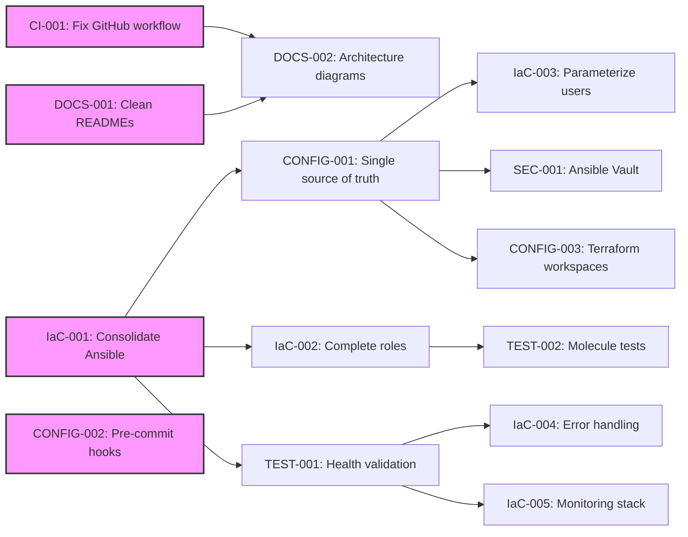

# Task Tracker - Supernova-MicroK8s-Infra

## Executive Summary

This tracker manages the refactoring and improvement of the Supernova-MicroK8s-Infra project, which automates deployment of a production-ready MicroK8s Kubernetes cluster on Proxmox. The tasks address critical configuration issues, code duplication, and missing validations identified during the code review.

## Current Status Overview

### Phase Progress

| Phase                        | Completion | Status      |
| ---------------------------- | ---------- | ----------- |
| Critical Fixes               | 0%         | 🔄 Active   |
| Configuration Consolidation  | 0%         | ⏸️ Planned  |
| Testing & Validation         | 0%         | ⏸️ Planned  |
| Documentation & Optimization | 0%         | ⏸️ Planned  |

### Quick Metrics

- **Critical Path Duration**: ~10 hours (CI and IaC tasks)
- **Total Effort Required**: ~28 hours
- **Target Completion**: 2025-10-01
- **Blockers**: None currently

## Phase 1: Critical Fixes

### Critical Path (P0)

| Task ID                           | Title                                   | Priority | Duration | Dependencies | Status   |
| --------------------------------- | --------------------------------------- | -------- | -------- | ------------ | -------- |
| [CI-001](ci/CI-001-*.md)         | Fix GitHub workflow infrastructure path | P0       | 1h       | None         | 🔄 Ready |
| [IaC-001](iac/IaC-001-*.md)      | Consolidate Ansible playbook logic     | P0       | 4h       | None         | 🔄 Ready |
| [DOCS-001](docs/DOCS-001-*.md)   | Clean up duplicate terraform READMEs   | P0       | 1h       | None         | 🔄 Ready |

**Phase 1 Total**: ~6 hours

## Phase 2: Configuration Consolidation

### Important Features (P1)

| Task ID                              | Title                                          | Priority | Duration | Dependencies | Status     |
| ------------------------------------ | ---------------------------------------------- | -------- | -------- | ------------ | ---------- |
| [CONFIG-001](config/CONFIG-001-*.md) | Create single source of truth for IPs/networks | P1       | 3h       | IaC-001      | ⏸️ Blocked |
| [IaC-002](iac/IaC-002-*.md)         | Complete empty Ansible role implementations    | P1       | 3h       | IaC-001      | ⏸️ Blocked |
| [CONFIG-002](config/CONFIG-002-*.md) | Enable and configure pre-commit hooks         | P1       | 1h       | None         | 🔄 Ready   |
| [IaC-003](iac/IaC-003-*.md)         | Parameterize ansible user configuration       | P1       | 2h       | CONFIG-001   | ⏸️ Blocked |

**Phase 2 Total**: ~9 hours

## Phase 3: Testing & Validation

### Testing Infrastructure (P1)

| Task ID                           | Title                                    | Priority | Duration | Dependencies | Status     |
| --------------------------------- | ---------------------------------------- | -------- | -------- | ------------ | ---------- |
| [TEST-001](test/TEST-001-*.md)   | Add cluster health validation tasks     | P1       | 2h       | IaC-001      | ⏸️ Blocked |
| [TEST-002](test/TEST-002-*.md)   | Create Molecule tests for Ansible roles | P2       | 3h       | IaC-002      | ⏸️ Blocked |
| [SEC-001](sec/SEC-001-*.md)      | Implement Ansible Vault for secrets     | P1       | 2h       | CONFIG-001   | ⏸️ Blocked |

**Phase 3 Total**: ~7 hours

## Phase 4: Documentation & Optimization

### Optimization (P2)

| Task ID                           | Title                                  | Priority | Duration | Dependencies | Status     |
| --------------------------------- | -------------------------------------- | -------- | -------- | ------------ | ---------- |
| [DOCS-002](docs/DOCS-002-*.md)   | Add architecture diagrams              | P2       | 2h       | DOCS-001     | ⏸️ Blocked |
| [IaC-004](iac/IaC-004-*.md)      | Add error handling and rollback       | P2       | 2h       | TEST-001     | ⏸️ Blocked |
| [IaC-005](iac/IaC-005-*.md)      | Add monitoring stack deployment       | P2       | 2h       | TEST-001     | ⏸️ Blocked |
| [CONFIG-003](config/CONFIG-003-*.md) | Implement Terraform workspaces    | P2       | 2h       | CONFIG-001   | ⏸️ Blocked |

**Phase 4 Total**: ~8 hours

## Task Dependencies



## Critical Path

The minimum time to completion follows this sequence:

1. **Critical Fixes** (Day 1-2):
   - CI-001: Fix GitHub workflow paths for documentation generation
   - IaC-001: Consolidate duplicate Ansible logic into roles
   - DOCS-001: Clean up terraform directory documentation

2. **Configuration Refactoring** (Day 3-4):
   - CONFIG-001: Create Terraform outputs → Ansible inventory integration
   - CONFIG-002: Enable all pre-commit hooks for code quality
   - IaC-002: Implement empty Ansible roles properly

3. **Validation & Security** (Day 5-6):
   - TEST-001: Add post-deployment validation
   - SEC-001: Secure sensitive variables with Ansible Vault
   - IaC-003: Make configurations more flexible

**Critical Path Duration**: ~10 hours for core functionality fixes

## Risk Register

| Risk                                    | Probability | Impact | Mitigation                                |
| --------------------------------------- | ----------- | ------ | ----------------------------------------- |
| Breaking existing deployments          | Medium      | High   | Test changes in isolated environment      |
| Terraform state conflicts              | Low         | High   | Backup state before major changes         |
| Ansible role refactoring complexity    | Medium      | Medium | Incremental migration, test each role     |
| Network configuration misalignment     | Low         | High   | Validate IP ranges don't conflict         |

## Success Criteria

- [ ] **CI/CD Fixed**: GitHub workflows run successfully on PRs
- [ ] **No Duplication**: Single source of truth for all configurations
- [ ] **Roles Functional**: All Ansible roles properly implemented and tested
- [ ] **Validation Complete**: Automated health checks confirm cluster deployment
- [ ] **Documentation Current**: Architecture diagrams and guides up-to-date

## Quick Commands

### Infrastructure Workflow

```bash
# Terraform operations
cd terraform
mise run fmt              # Format Terraform files
mise run prod-validate    # Validate configuration
mise run plan            # Plan infrastructure changes
mise run apply           # Apply infrastructure changes

# Ansible operations
cd ansible
ansible-playbook -i inventory/hosts.yml playbooks/playbook.yml --check  # Dry run
ansible-playbook -i inventory/hosts.yml playbooks/playbook.yml          # Deploy
ansible-lint             # Check Ansible code quality

# Validation
mise run full-check      # Complete validation suite
mise run ansible-lint    # Lint Ansible files
```

### Task Management

```bash
# Find ready tasks
grep "🔄 Ready" tasks/INDEX.md

# Check specific task
cat tasks/iac/IaC-001-*.md

# Update task status
# Edit INDEX.md and change status indicators
```

## Notes

- Tasks marked 🔄 Ready can be started immediately
- P0 tasks in Phase 1 are critical and block many other improvements
- CONFIG-001 is a key dependency that will unblock multiple tasks
- Consider using feature branches for major refactoring tasks

## References

- [Project README](../README.md)
- [Terraform Documentation](../terraform/README.md)
- [Ansible Roles](../ansible/roles/)
- [Mise Configuration](../.mise.toml)

## Task Categories

- **CI**: CI/CD pipeline and automation fixes
- **IaC**: Infrastructure as Code improvements (Terraform/Ansible)
- **CONFIG**: Configuration management and consistency
- **DOCS**: Documentation improvements
- **TEST**: Testing and validation infrastructure
- **SEC**: Security enhancements

---

_Use [README.md](README.md) for task system documentation_
_Individual task details in respective task files_
