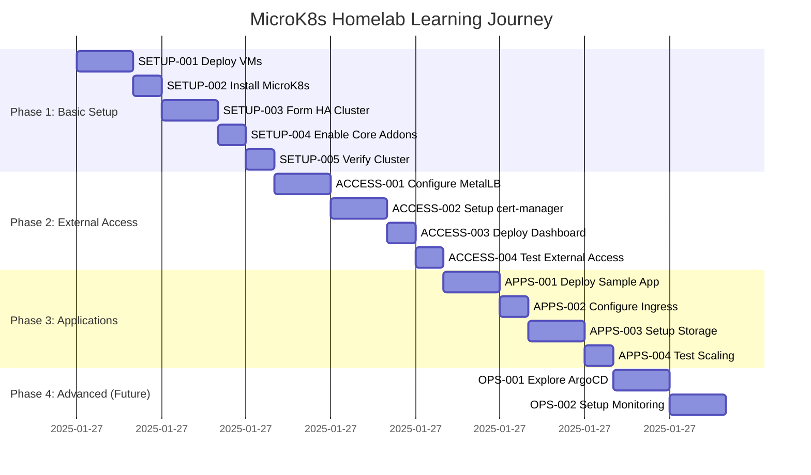

# Task Tracker - MicroK8s Homelab Learning Journey

## Executive Summary

This tracker manages the hands-on learning journey for building a MicroK8s homelab cluster. Focus on learning Kubernetes concepts through practical implementation rather than production deployment. Tasks follow the 4-phase learning roadmap from basic cluster setup through advanced operations.

## Current Status Overview

### Phase Progress

| Phase                  | Completion | Status     |
| ---------------------- | ---------- | ---------- |
| Basic Cluster Setup    | 0%         | 🔄 Ready   |
| External Access        | 0%         | ⏸️ Planned |
| Application Deployment | 0%         | ⏸️ Planned |
| Advanced Operations    | 0%         | ⏸️ Planned |

### Quick Metrics

- **Critical Path Duration**: ~6 hours (SETUP tasks)
- **Total Effort Required**: ~24 hours
- **Target Completion**: 4 weeks (learn at your own pace)
- **Blockers**: None currently - ready to start learning!

## Phase 1: Basic Cluster Setup (Week 1)

### Core Learning Tasks (P0)

| Task ID                                            | Title                                      | Priority | Duration | Dependencies | Status     |
| -------------------------------------------------- | ------------------------------------------ | -------- | -------- | ------------ | ---------- |
| [SETUP-001](setup/SETUP-001-deploy-vms.md)         | Deploy 3 Ubuntu VMs on Proxmox             | P0       | 2h       | None         | 🔄 Ready   |
| [SETUP-002](setup/SETUP-002-install-microk8s.md)   | Install MicroK8s on all nodes              | P0       | 1h       | SETUP-001    | ⏸️ Blocked |
| [SETUP-003](setup/SETUP-003-form-ha-cluster.md)    | Form HA cluster (3 nodes)                  | P0       | 2h       | SETUP-002    | ⏸️ Blocked |
| [SETUP-004](setup/SETUP-004-enable-core-addons.md) | Enable core addons (dns, storage, ingress) | P0       | 1h       | SETUP-003    | ⏸️ Blocked |

### Validation Tasks (P1)

| Task ID                                        | Title                 | Priority | Duration | Dependencies | Status     |
| ---------------------------------------------- | --------------------- | -------- | -------- | ------------ | ---------- |
| [SETUP-005](setup/SETUP-005-verify-cluster.md) | Verify cluster health | P1       | 1h       | SETUP-004    | ⏸️ Blocked |

### Optimization (P2)

| Task ID                                      | Title              | Priority | Duration | Dependencies | Status     |
| -------------------------------------------- | ------------------ | -------- | -------- | ------------ | ---------- |
| [[PREFIX]-006]([category]/[PREFIX]-006-*.md) | <Brief task title> | P2       | Xh       | [PREFIX]-005 | ⏸️ Blocked |

**Phase 1 Total**: ~7 hours

## Phase 2: External Access & Services (Week 2)

### Core Learning Tasks (P0)

| Task ID                                               | Title                                | Priority | Duration | Dependencies | Status     |
| ----------------------------------------------------- | ------------------------------------ | -------- | -------- | ------------ | ---------- |
| [ACCESS-001](access/ACCESS-001-configure-metallb.md)  | Configure MetalLB for load balancing | P0       | 2h       | SETUP-005    | ⏸️ Blocked |
| [ACCESS-002](access/ACCESS-002-setup-cert-manager.md) | Set up cert-manager for TLS          | P0       | 2h       | ACCESS-001   | ⏸️ Blocked |
| [ACCESS-003](access/ACCESS-003-deploy-dashboard.md)   | Deploy Kubernetes dashboard          | P0       | 1h       | ACCESS-002   | ⏸️ Blocked |

### Validation Tasks (P1)

| Task ID                                                 | Title                         | Priority | Duration | Dependencies | Status     |
| ------------------------------------------------------- | ----------------------------- | -------- | -------- | ------------ | ---------- |
| [ACCESS-004](access/ACCESS-004-test-external-access.md) | Test external access with TLS | P1       | 1h       | ACCESS-003   | ⏸️ Blocked |

**Phase 2 Total**: ~6 hours

## Phase 3: Application Deployment (Week 3)

### Core Learning Tasks (P0)

| Task ID                                               | Title                                 | Priority | Duration | Dependencies | Status     |
| ----------------------------------------------------- | ------------------------------------- | -------- | -------- | ------------ | ---------- |
| [APPS-001](apps/APPS-001-deploy-sample-app.md)        | Deploy sample application             | P0       | 2h       | ACCESS-004   | ⏸️ Blocked |
| [APPS-002](apps/APPS-002-configure-ingress.md)        | Configure ingress for external access | P0       | 1h       | APPS-001     | ⏸️ Blocked |
| [APPS-003](apps/APPS-003-setup-persistent-storage.md) | Set up persistent storage             | P0       | 2h       | APPS-002     | ⏸️ Blocked |

### Validation Tasks (P1)

| Task ID                                   | Title                    | Priority | Duration | Dependencies | Status     |
| ----------------------------------------- | ------------------------ | -------- | -------- | ------------ | ---------- |
| [APPS-004](apps/APPS-004-test-scaling.md) | Test application scaling | P1       | 1h       | APPS-003     | ⏸️ Blocked |

**Phase 3 Total**: ~6 hours

## Phase 4: Advanced Operations & GitOps (Future)

### Core Learning Tasks (P0)

| Task ID                                    | Title                     | Priority | Duration | Dependencies | Status     |
| ------------------------------------------ | ------------------------- | -------- | -------- | ------------ | ---------- |
| [OPS-001](ops/OPS-001-explore-argocd.md)   | Explore ArgoCD for GitOps | P0       | 2h       | APPS-004     | ⏸️ Blocked |
| [OPS-002](ops/OPS-002-setup-monitoring.md) | Set up monitoring stack   | P0       | 2h       | OPS-001      | ⏸️ Blocked |

**Phase 4 Total**: ~4 hours

## Task Dependencies

```mermaid
graph LR
    SETUP001[SETUP-001: Deploy VMs] --> SETUP002[SETUP-002: Install MicroK8s]
    SETUP002 --> SETUP003[SETUP-003: Form HA Cluster]
    SETUP003 --> SETUP004[SETUP-004: Enable Addons]
    SETUP004 --> SETUP005[SETUP-005: Verify Cluster]

    SETUP005 --> ACCESS001[ACCESS-001: Configure MetalLB]
    ACCESS001 --> ACCESS002[ACCESS-002: Setup cert-manager]
    ACCESS002 --> ACCESS003[ACCESS-003: Deploy Dashboard]
    ACCESS003 --> ACCESS004[ACCESS-004: Test External Access]

    ACCESS004 --> APPS001[APPS-001: Deploy Sample App]
    APPS001 --> APPS002[APPS-002: Configure Ingress]
    APPS002 --> APPS003[APPS-003: Setup Storage]
    APPS003 --> APPS004[APPS-004: Test Scaling]

    APPS004 --> OPS001[OPS-001: Explore ArgoCD]
    OPS001 --> OPS002[OPS-002: Setup Monitoring]

    style SETUP001 fill:#f9f,stroke:#333,stroke-width:2px
    style SETUP002 fill:#f9f,stroke:#333,stroke-width:2px
    style SETUP003 fill:#f9f,stroke:#333,stroke-width:2px
```



## Execution Timeline



## Critical Path

The learning journey follows this progressive sequence:

1. **Phase 1: Cluster Foundation** (~7 hours):

   - SETUP-001: Deploy 3 Ubuntu VMs on Proxmox
   - SETUP-002: Install MicroK8s on all nodes
   - SETUP-003: Form HA cluster with 3 nodes
   - SETUP-004: Enable core addons (DNS, storage, ingress)
   - SETUP-005: Verify cluster health

2. **Phase 2: External Access** (~6 hours):

   - ACCESS-001: Configure MetalLB for load balancing
   - ACCESS-002: Set up cert-manager for TLS certificates
   - ACCESS-003: Deploy Kubernetes dashboard
   - ACCESS-004: Test external access with TLS

3. **Phase 3: Application Deployment** (~6 hours):

   - APPS-001: Deploy sample application
   - APPS-002: Configure ingress for external access
   - APPS-003: Set up persistent storage
   - APPS-004: Test application scaling

4. **Phase 4: Advanced Operations** (~4 hours):

   - OPS-001: Explore ArgoCD for GitOps
   - OPS-002: Set up monitoring stack

**Critical Path Duration**: ~23 hours for complete learning journey

## Risk Register

| Risk                                 | Probability | Impact | Mitigation                                        |
| ------------------------------------ | ----------- | ------ | ------------------------------------------------- |
| VM deployment issues on Proxmox      | Medium      | High   | Start with single VM, verify Proxmox access first |
| Network connectivity problems        | Medium      | High   | Test basic connectivity before cluster formation  |
| MicroK8s addon conflicts             | Low         | Medium | Enable addons one at a time, test after each      |
| Certificate issues with cert-manager | Low         | Medium | Use self-signed certs initially for testing       |
| Storage configuration errors         | Low         | Medium | Test with simple hostPath before advanced storage |

## Success Criteria

- [ ] **Phase 1 Complete**: Working 3-node HA MicroK8s cluster with core addons
- [ ] **Phase 2 Complete**: External access working via MetalLB and TLS
- [ ] **Phase 3 Complete**: Sample application deployed and accessible
- [ ] **Phase 4 Complete**: GitOps and monitoring explored (optional)

## Quick Commands

### Cluster Management

```bash
# Check cluster status
uv run ansible-playbook playbooks/examples/quick-status.yml

# Access cluster
microk8s kubectl get nodes
microk8s kubectl get pods -A

# Enable additional addons
microk8s enable dashboard metallb cert-manager

# Access dashboard (after enabling)
microk8s kubectl port-forward -n kube-system service/kubernetes-dashboard 10443:443
```

## Notes

- Tasks marked 🔄 Ready can be started immediately - begin with SETUP-001
- This is a **learning journey**, not a production deployment
- Go at your own pace - each phase builds understanding
- Document what you learn in each task for future reference
- The goal is understanding, not speed

## References

- [Learning Roadmap](../../docs/learning-roadmap.md) - Your complete learning guide
- [Setup Guide](../../docs/setup-guide.md) - Detailed MicroK8s installation
- [Ansible Standards](../../docs/standards/ansible-standards.md) - Automation best practices
- [Inspiration](../../docs/inspiration.md) - Alternative approaches

---

_Use [README.md](README.md) for task system documentation_
_Start with SETUP-001: Deploy 3 Ubuntu VMs on Proxmox_
