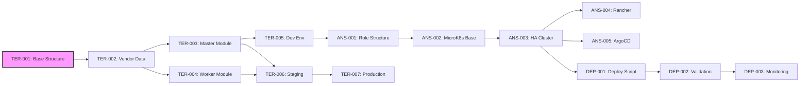
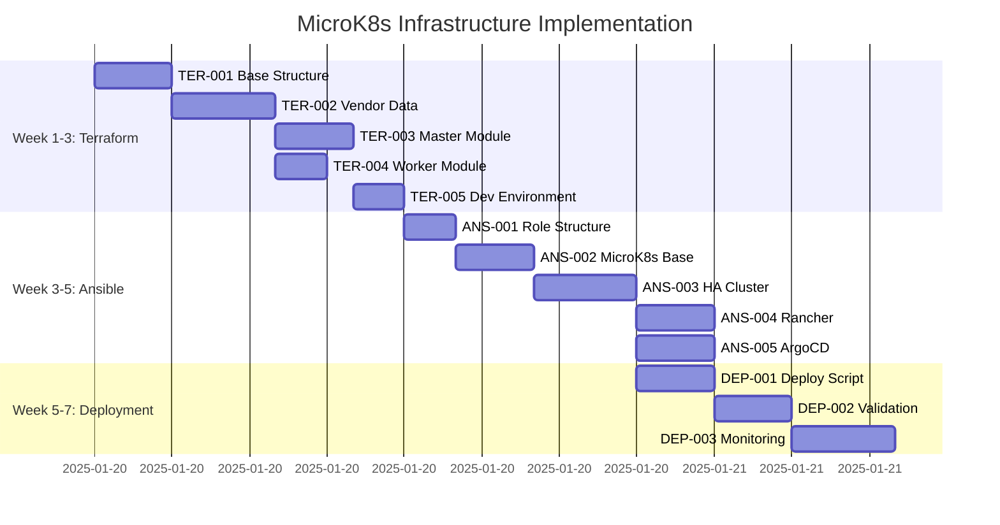

# Task Tracker - MicroK8s Infrastructure Deployment

## Executive Summary

This tracker manages the implementation of a unified, automated MicroK8s deployment system for Proxmox. The project integrates sophisticated Terraform patterns with MicroK8s deployment logic, transforming scattered infrastructure code into a cohesive, production-ready solution as outlined in [Planning Document](../docs/planning.md).

## Current Status Overview

### Phase Progress

| Phase                 | Completion | Status     |
| --------------------- | ---------- | ---------- |
| Terraform Setup       | 0%         | 🔄 Ready   |
| Ansible Configuration | 0%         | ⏸️ Planned |
| Deployment Pipeline   | 0%         | ⏸️ Planned |

### Quick Metrics

- **Critical Path Duration**: ~20 hours (TER + initial ANS tasks)
- **Total Effort Required**: ~45 hours
- **Target Completion**: 7 weeks from start
- **Current Blockers**: None - ready to begin

## Phase 1: Terraform Infrastructure Setup

### Foundation Tasks (Week 1-3)

| Task ID                                                      | Title                                | Priority | Duration | Dependencies    | Status     |
| ------------------------------------------------------------ | ------------------------------------ | -------- | -------- | --------------- | ---------- |
| [TER-001](terraform-setup/TER-001-create-base-structure.md)  | Create Base Infrastructure Structure | P0       | 3h       | None            | 🔄 Ready   |
| [TER-002](terraform-setup/TER-002-vendor-data-microk8s.md)   | Develop MicroK8s Vendor Data         | P0       | 4h       | TER-001         | ⏸️ Blocked |
| [TER-003](terraform-setup/TER-003-master-module.md)          | Create Master Node Module            | P0       | 3h       | TER-002         | ⏸️ Blocked |
| [TER-004](terraform-setup/TER-004-worker-module.md)          | Create Worker Node Module            | P1       | 2h       | TER-002         | ⏸️ Blocked |
| [TER-005](terraform-setup/TER-005-dev-environment.md)        | Configure Development Environment    | P0       | 2h       | TER-003         | ⏸️ Blocked |
| [TER-006](terraform-setup/TER-006-staging-environment.md)    | Configure Staging Environment        | P1       | 3h       | TER-003,TER-004 | ⏸️ Blocked |
| [TER-007](terraform-setup/TER-007-production-environment.md) | Configure Production Environment     | P1       | 3h       | TER-006         | ⏸️ Blocked |

**Phase 1 Total**: ~20 hours

## Phase 2: Ansible Configuration

### MicroK8s Setup Tasks (Week 3-5)

| Task ID                                                        | Title                           | Priority | Duration | Dependencies | Status     |
| -------------------------------------------------------------- | ------------------------------- | -------- | -------- | ------------ | ---------- |
| [ANS-001](ansible-configuration/ANS-001-role-structure.md)     | Create Ansible Role Structure   | P0       | 2h       | TER-005      | ⏸️ Blocked |
| [ANS-002](ansible-configuration/ANS-002-microk8s-base.md)      | MicroK8s Base Installation Role | P0       | 3h       | ANS-001      | ⏸️ Blocked |
| [ANS-003](ansible-configuration/ANS-003-ha-cluster.md)         | HA Cluster Formation Role       | P0       | 4h       | ANS-002      | ⏸️ Blocked |
| [ANS-004](ansible-configuration/ANS-004-rancher-deployment.md) | Rancher Deployment Role         | P1       | 3h       | ANS-003      | ⏸️ Blocked |
| [ANS-005](ansible-configuration/ANS-005-argocd-deployment.md)  | ArgoCD Deployment Role          | P1       | 3h       | ANS-003      | ⏸️ Blocked |

**Phase 2 Total**: ~15 hours

## Phase 3: Deployment Pipeline

### Automation Tasks (Week 5-7)

| Task ID                                              | Title                         | Priority | Duration | Dependencies | Status     |
| ---------------------------------------------------- | ----------------------------- | -------- | -------- | ------------ | ---------- |
| [DEP-001](deployment/DEP-001-deployment-script.md)   | Create Main Deployment Script | P0       | 3h       | ANS-003      | ⏸️ Blocked |
| [DEP-002](deployment/DEP-002-validation-playbook.md) | Cluster Validation Playbook   | P0       | 3h       | DEP-001      | ⏸️ Blocked |
| [DEP-003](deployment/DEP-003-monitoring-setup.md)    | Monitoring Integration        | P2       | 4h       | DEP-002      | ⏸️ Blocked |

**Phase 3 Total**: ~10 hours

## Task Dependencies



## Execution Timeline



## Critical Path

The minimum time to a functional MicroK8s cluster:

1. **Week 1-2**: Foundation

   - TER-001: Create base structure (3h)
   - TER-002: Vendor data configuration (4h)
   - TER-003: Master module (3h)

2. **Week 2-3**: Environment Setup

   - TER-005: Development environment (2h)
   - Single-node testing and validation

3. **Week 3-4**: Ansible Configuration

   - ANS-001: Role structure (2h)
   - ANS-002: MicroK8s base (3h)
   - ANS-003: HA cluster formation (4h)

4. **Week 5**: Deployment Pipeline
   - DEP-001: Deployment script (3h)
   - DEP-002: Validation (3h)

**Critical Path Duration**: ~24 hours for minimal viable deployment

## Risk Register

| Risk                                        | Probability | Impact | Mitigation                             |
| ------------------------------------------- | ----------- | ------ | -------------------------------------- |
| Vendor data complexity causes boot failures | Medium      | High   | Incremental testing, fallback configs  |
| Network segmentation issues                 | Medium      | High   | Start simple, add complexity gradually |
| Ansible role compatibility                  | Low         | Medium | Maintain backward compatibility        |
| MicroK8s version conflicts                  | Low         | Medium | Pin versions, test upgrades            |
| Terraform state corruption                  | Low         | High   | Use workspaces, regular backups        |

## Success Criteria

- [ ] **Infrastructure as Code**: All components version controlled
- [ ] **Automated Deployment**: Single command cluster creation
- [ ] **HA Configuration**: 3+ node clusters with automatic failover
- [ ] **Environment Parity**: Dev/Staging/Prod with consistent tooling
- [ ] **Validation Suite**: Automated testing at each stage
- [ ] **Documentation**: Complete guides for operations

## Quick Commands

### Current State (Manual Process)

```bash
# Separate terraform and ansible runs
cd terraform/
terraform apply
# Manual ansible inventory creation
cd ../ansible/
ansible-playbook playbook.yml
```

### Target State (After Implementation)

```bash
# Single integrated deployment
cd infrastructure-microk8s/
./scripts/deploy.sh production

# Automated flow:
# 1. Terraform provisions VMs with vendor_data
# 2. Inventory auto-generated
# 3. Ansible configures MicroK8s cluster
# 4. Validation runs automatically
# 5. Report generated
```

## Notes

- Tasks marked 🔄 Ready can be started immediately
- TER-001 is the only unblocked task - start here
- Parallel work possible after TER-002 completes
- Focus on development environment first for rapid iteration
- Production deployment only after staging validation

## References

- [Planning Document](../docs/planning.md) - Comprehensive integration strategy
- [Blueprint](../docs/blueprint.md) - MicroK8s architecture overview
- [Current Infrastructure](../infrastructure/) - Reference Terraform patterns
- [Ansible Setup](../ansible/) - Existing MicroK8s playbooks
- [Task Template](template.md) - For creating new tasks

---

_Use [README.md](README.md) for task system documentation_
_Individual task details in respective directories_
